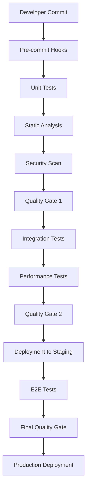

# EJERCICIO 4: Integración CI/CD y Quality Gates - Nivel Semi-Senior

## Objetivos Estratégicos

Este ejercicio desarrolla competencias en la implementación de pipelines de integración continua con quality gates automatizados, diseñados para sistemas financieros críticos donde la calidad del código es fundamental para el cumplimiento regulatorio y la estabilidad operacional.

---

## Arquitectura de Quality Gates Empresariales

### Estrategia de Calidad Multi-Etapa



### Definición de Quality Gates por Entorno

#### Quality Gate 1: Code Quality (Feature Branch)
```yaml
# .github/workflows/quality-gate-1.yml
name: Quality Gate 1 - Code Quality

on:
  pull_request:
    branches: [ main, develop ]
  push:
    branches: [ feature/* ]

jobs:
  static-analysis:
    runs-on: ubuntu-latest
    timeout-minutes: 15
    
    steps:
    - name: Checkout code
      uses: actions/checkout@v4
      with:
        fetch-depth: 0

    - name: Setup .NET
      uses: actions/setup-dotnet@v4
      with:
        dotnet-version: 8.0.x

    - name: Restore dependencies
      run: dotnet restore

    - name: Build solution
      run: dotnet build --no-restore --configuration Release

    - name: Run unit tests with coverage
      run: |
        dotnet test --no-build --configuration Release \
          --collect:"XPlat Code Coverage" \
          --results-directory ./coverage \
          --logger trx \
          --verbosity normal

    - name: SonarCloud Analysis
      uses: SonarSource/sonarcloud-github-action@master
      env:
        GITHUB_TOKEN: ${{ secrets.GITHUB_TOKEN }}
        SONAR_TOKEN: ${{ secrets.SONAR_TOKEN }}
      with:
        args: >
          -Dsonar.projectKey=fintech-payment-processor
          -Dsonar.organization=fintech-corp
          -Dsonar.cs.opencover.reportsPaths=coverage/**/coverage.opencover.xml
          -Dsonar.coverage.exclusions=**/Migrations/**,**/Program.cs,**/Startup.cs
          -Dsonar.exclusions=**/bin/**,**/obj/**,**/packages/**
          -Dsonar.qualitygate.wait=true
          -Dsonar.qualitygate.timeout=300

    - name: Quality Gate Status Check
      run: |
        # Wait for SonarCloud quality gate result
        sleep 60
        
        # Check if quality gate passed
        QUALITY_GATE_STATUS=$(curl -s -u ${{ secrets.SONAR_TOKEN }}: \
          "https://sonarcloud.io/api/qualitygates/project_status?projectKey=fintech-payment-processor" \
          | jq -r '.projectStatus.status')
        
        if [ "$QUALITY_GATE_STATUS" != "OK" ]; then
          echo "Quality Gate failed with status: $QUALITY_GATE_STATUS"
          exit 1
        fi
        
        echo "Quality Gate passed successfully"

    - name: Security Scan
      uses: securecodewarrior/github-action-add-sarif@v1
      with:
        sarif-file: security-scan-results.sarif
```

#### Quality Gate 2: Integration & Performance

```yaml
# .github/workflows/quality-gate-2.yml
name: Quality Gate 2 - Integration & Performance

on:
  push:
    branches: [ main, develop ]

jobs:
  integration-tests:
    runs-on: ubuntu-latest
    timeout-minutes: 30
    
    services:
      postgres:
        image: postgres:15
        env:
          POSTGRES_PASSWORD: postgres
          POSTGRES_DB: paymentprocessor_test
        options: >-
          --health-cmd pg_isready
          --health-interval 10s
          --health-timeout 5s
          --health-retries 5
        ports:
          - 5432:5432

      redis:
        image: redis:7-alpine
        ports:
          - 6379:6379

    steps:
    - name: Checkout code
      uses: actions/checkout@v4

    - name: Setup .NET
      uses: actions/setup-dotnet@v4
      with:
        dotnet-version: 8.0.x

    - name: Run integration tests
      run: |
        dotnet test tests/PaymentProcessor.IntegrationTests \
          --configuration Release \
          --logger trx \
          --collect:"XPlat Code Coverage" \
          --results-directory ./integration-coverage
      env:
        ConnectionStrings__Database: "Host=localhost;Database=paymentprocessor_test;Username=postgres;Password=postgres"
        ConnectionStrings__Redis: "localhost:6379"

    - name: Performance Tests
      run: |
        dotnet run --project tests/PaymentProcessor.PerformanceTests \
          --configuration Release \
          -- --output performance-results.json

    - name: Validate Performance SLA
      run: |
        # Parse performance results
        AVG_RESPONSE_TIME=$(jq -r '.averageResponseTime' performance-results.json)
        P95_RESPONSE_TIME=$(jq -r '.p95ResponseTime' performance-results.json)
        THROUGHPUT=$(jq -r '.throughputPerSecond' performance-results.json)
        ERROR_RATE=$(jq -r '.errorRate' performance-results.json)
        
        # Validate SLA thresholds
        if (( $(echo "$AVG_RESPONSE_TIME > 200" | bc -l) )); then
          echo "Average response time ($AVG_RESPONSE_TIME ms) exceeds SLA (200ms)"
          exit 1
        fi
        
        if (( $(echo "$P95_RESPONSE_TIME > 500" | bc -l) )); then
          echo "P95 response time ($P95_RESPONSE_TIME ms) exceeds SLA (500ms)"
          exit 1
        fi
        
        if (( $(echo "$THROUGHPUT < 1000" | bc -l) )); then
          echo "Throughput ($THROUGHPUT req/s) below SLA (1000 req/s)"
          exit 1
        fi
        
        if (( $(echo "$ERROR_RATE > 0.1" | bc -l) )); then
          echo "Error rate ($ERROR_RATE%) exceeds SLA (0.1%)"
          exit 1
        fi
        
        echo "All performance SLAs met successfully"

    - name: Upload performance artifacts
      uses: actions/upload-artifact@v4
      with:
        name: performance-results
        path: performance-results.json
```

---

## Azure DevOps Pipeline Empresarial

### Pipeline Multi-Etapa con Quality Gates

```yaml
# azure-pipelines.yml
trigger:
  branches:
    include:
    - main
    - develop
    - feature/*
    - release/*

pr:
  branches:
    include:
    - main
    - develop

variables:
  buildConfiguration: 'Release'
  vmImageName: 'ubuntu-latest'
  dotNetVersion: '8.0.x'

pool:
  vmImage: $(vmImageName)

stages:
- stage: Build
  displayName: 'Build and Unit Tests'
  jobs:
  - job: Build
    displayName: 'Build Job'
    steps:
    - task: UseDotNet@2
      displayName: 'Use .NET Core SDK'
      inputs:
        version: $(dotNetVersion)
        includePreviewVersions: true

    - task: DotNetCoreCLI@2
      displayName: 'Restore NuGet packages'
      inputs:
        command: 'restore'
        projects: '**/*.csproj'

    - task: DotNetCoreCLI@2
      displayName: 'Build solution'
      inputs:
        command: 'build'
        projects: '**/*.csproj'
        arguments: '--configuration $(buildConfiguration) --no-restore'

    - task: DotNetCoreCLI@2
      displayName: 'Run unit tests'
      inputs:
        command: 'test'
        projects: '**/*UnitTests/*.csproj'
        arguments: '--configuration $(buildConfiguration) --no-build --collect:"XPlat Code Coverage" --logger trx --results-directory $(Agent.TempDirectory)'

    - task: PublishTestResults@2
      displayName: 'Publish unit test results'
      inputs:
        testResultsFormat: 'VSTest'
        testResultsFiles: '**/*.trx'
        searchFolder: '$(Agent.TempDirectory)'

    - task: PublishCodeCoverageResults@1
      displayName: 'Publish code coverage'
      inputs:
        codeCoverageTool: 'Cobertura'
        summaryFileLocation: '$(Agent.TempDirectory)/**/coverage.cobertura.xml'

- stage: QualityGate1
  displayName: 'Quality Gate 1 - Code Quality'
  dependsOn: Build
  condition: succeeded()
  jobs:
  - job: CodeQuality
    displayName: 'Code Quality Analysis'
    steps:
    - task: SonarCloudPrepare@1
      displayName: 'Prepare SonarCloud analysis'
      inputs:
        SonarCloud: 'SonarCloud'
        organization: 'fintech-corp'
        scannerMode: 'MSBuild'
        projectKey: 'fintech-payment-processor'
        projectName: 'Payment Processor'
        projectVersion: '$(Build.BuildNumber)'
        extraProperties: |
          sonar.cs.opencover.reportsPaths=$(Agent.TempDirectory)/**/coverage.opencover.xml
          sonar.coverage.exclusions=**/Migrations/**,**/Program.cs,**/Startup.cs,**/*Tests/**
          sonar.exclusions=**/bin/**,**/obj/**,**/packages/**
          sonar.qualitygate.wait=true
          sonar.qualitygate.timeout=300

    - task: DotNetCoreCLI@2
      displayName: 'Build for analysis'
      inputs:
        command: 'build'
        projects: '**/*.csproj'
        arguments: '--configuration $(buildConfiguration)'

    - task: SonarCloudAnalyze@1
      displayName: 'Run SonarCloud analysis'

    - task: SonarCloudPublish@1
      displayName: 'Publish SonarCloud results'
      inputs:
        pollingTimeoutSec: '300'

    - task: PowerShell@2
      displayName: 'Validate Quality Gate'
      inputs:
        targetType: 'inline'
        script: |
          $headers = @{
            'Authorization' = "Bearer $(sonarCloudToken)"
          }
          
          $response = Invoke-RestMethod -Uri "https://sonarcloud.io/api/qualitygates/project_status?projectKey=fintech-payment-processor" -Headers $headers
          
          if ($response.projectStatus.status -ne "OK") {
            Write-Host "Quality Gate failed with status: $($response.projectStatus.status)"
            Write-Host "Conditions:"
            foreach ($condition in $response.projectStatus.conditions) {
              Write-Host "  - $($condition.metricKey): $($condition.actualValue) $($condition.comparator) $($condition.errorThreshold) -> $($condition.status)"
            }
            exit 1
          }
          
          Write-Host "Quality Gate passed successfully"

- stage: QualityGate2
  displayName: 'Quality Gate 2 - Integration & Security'
  dependsOn: QualityGate1
  condition: succeeded()
  jobs:
  - job: IntegrationTests
    displayName: 'Integration Tests'
    services:
      postgres:
        image: postgres:15
        env:
          POSTGRES_PASSWORD: postgres
          POSTGRES_DB: paymentprocessor_test
        ports:
          - 5432:5432

    steps:
    - task: DotNetCoreCLI@2
      displayName: 'Run integration tests'
      inputs:
        command: 'test'
        projects: '**/*IntegrationTests/*.csproj'
        arguments: '--configuration $(buildConfiguration) --logger trx --collect:"XPlat Code Coverage"'
      env:
        ConnectionStrings__Database: "Host=localhost;Database=paymentprocessor_test;Username=postgres;Password=postgres"

  - job: SecurityScan
    displayName: 'Security Scanning'
    steps:
    - task: UseDotNet@2
      inputs:
        version: $(dotNetVersion)

    - task: DotNetCoreCLI@2
      displayName: 'Install security scanning tools'
      inputs:
        command: 'custom'
        custom: 'tool'
        arguments: 'install --global security-scan'

    - task: PowerShell@2
      displayName: 'Run security scan'
      inputs:
        targetType: 'inline'
        script: |
          security-scan --project-path "." --output-format "sarif" --output-file "security-results.sarif"

    - task: PublishBuildArtifacts@1
      displayName: 'Publish security scan results'
      inputs:
        PathtoPublish: 'security-results.sarif'
        ArtifactName: 'security-scan-results'

- stage: QualityGate3
  displayName: 'Quality Gate 3 - Performance & Reliability'
  dependsOn: QualityGate2
  condition: succeeded()
  jobs:
  - job: PerformanceTests
    displayName: 'Performance Testing'
    steps:
    - task: DotNetCoreCLI@2
      displayName: 'Run performance tests'
      inputs:
        command: 'run'
        projects: 'tests/PaymentProcessor.PerformanceTests/PaymentProcessor.PerformanceTests.csproj'
        arguments: '--configuration $(buildConfiguration) -- --output $(Build.ArtifactStagingDirectory)/performance-results.json'

    - task: PowerShell@2
      displayName: 'Validate performance SLA'
      inputs:
        targetType: 'inline'
        script: |
          $results = Get-Content "$(Build.ArtifactStagingDirectory)/performance-results.json" | ConvertFrom-Json
          
          # SLA Thresholds
          $maxAvgResponseTime = 200  # ms
          $maxP95ResponseTime = 500  # ms
          $minThroughput = 1000      # req/s
          $maxErrorRate = 0.1        # %
          
          $slaViolations = @()
          
          if ($results.averageResponseTime -gt $maxAvgResponseTime) {
            $slaViolations += "Average response time ($($results.averageResponseTime)ms) exceeds SLA (${maxAvgResponseTime}ms)"
          }
          
          if ($results.p95ResponseTime -gt $maxP95ResponseTime) {
            $slaViolations += "P95 response time ($($results.p95ResponseTime)ms) exceeds SLA (${maxP95ResponseTime}ms)"
          }
          
          if ($results.throughputPerSecond -lt $minThroughput) {
            $slaViolations += "Throughput ($($results.throughputPerSecond) req/s) below SLA (${minThroughput} req/s)"
          }
          
          if ($results.errorRate -gt $maxErrorRate) {
            $slaViolations += "Error rate ($($results.errorRate)%) exceeds SLA (${maxErrorRate}%)"
          }
          
          if ($slaViolations.Count -gt 0) {
            Write-Host "Performance SLA violations detected:"
            foreach ($violation in $slaViolations) {
              Write-Host "  - $violation"
            }
            exit 1
          }
          
          Write-Host "All performance SLAs met successfully"

    - task: PublishBuildArtifacts@1
      displayName: 'Publish performance results'
      inputs:
        PathtoPublish: '$(Build.ArtifactStagingDirectory)/performance-results.json'
        ArtifactName: 'performance-results'

- stage: Deploy
  displayName: 'Deploy to Staging'
  dependsOn: QualityGate3
  condition: and(succeeded(), eq(variables['Build.SourceBranch'], 'refs/heads/main'))
  jobs:
  - deployment: DeployStaging
    displayName: 'Deploy to Staging Environment'
    environment: 'staging'
    strategy:
      runOnce:
        deploy:
          steps:
          - task: AzureWebApp@1
            displayName: 'Deploy to Azure Web App'
            inputs:
              azureSubscription: 'Azure Service Connection'
              appType: 'webAppLinux'
              appName: 'payment-processor-staging'
              package: '$(Pipeline.Workspace)/**/*.zip'
```

---

## Configuración Avanzada de SonarQube

### Quality Profile Personalizado

```xml
<!-- sonar-quality-profile.xml -->
<profile>
  <name>Fintech Enterprise Profile</name>
  <language>cs</language>
  <rules>
    <!-- Security Rules - Críticas -->
    <rule>
      <repositoryKey>csharpsquid</repositoryKey>
      <key>S2245</key>
      <priority>BLOCKER</priority>
      <parameters>
        <parameter>
          <key>SecureRandomClasses</key>
          <value>System.Security.Cryptography.RandomNumberGenerator</value>
        </parameter>
      </parameters>
    </rule>
    
    <!-- Complexity Rules - Estrictas para fintech -->
    <rule>
      <repositoryKey>csharpsquid</repositoryKey>
      <key>S1541</key>
      <priority>CRITICAL</priority>
      <parameters>
        <parameter>
          <key>maximumFunctionComplexityThreshold</key>
          <value>8</value>
        </parameter>
      </parameters>
    </rule>
    
    <!-- Maintainability Rules -->
    <rule>
      <repositoryKey>csharpsquid</repositoryKey>
      <key>S138</key>
      <priority>MAJOR</priority>
      <parameters>
        <parameter>
          <key>max</key>
          <value>50</value>
        </parameter>
      </parameters>
    </rule>
    
    <!-- Performance Rules -->
    <rule>
      <repositoryKey>csharpsquid</repositoryKey>
      <key>S1854</key>
      <priority>MAJOR</priority>
    </rule>
    
    <!-- Reliability Rules -->
    <rule>
      <repositoryKey>csharpsquid</repositoryKey>
      <key>S2259</key>
      <priority>BLOCKER</priority>
    </rule>
  </rules>
</profile>
```

### Quality Gate Empresarial

```json
{
  "name": "Fintech Enterprise Gate",
  "conditions": [
    {
      "id": 1,
      "metric": "new_reliability_rating",
      "op": "GT",
      "value": "1",
      "onLeakPeriod": true
    },
    {
      "id": 2,
      "metric": "new_security_rating",
      "op": "GT",
      "value": "1",
      "onLeakPeriod": true
    },
    {
      "id": 3,
      "metric": "new_maintainability_rating",
      "op": "GT",
      "value": "1",
      "onLeakPeriod": true
    },
    {
      "id": 4,
      "metric": "new_coverage",
      "op": "LT",
      "value": "80",
      "onLeakPeriod": true
    },
    {
      "id": 5,
      "metric": "new_duplicated_lines_density",
      "op": "GT",
      "value": "3",
      "onLeakPeriod": true
    },
    {
      "id": 6,
      "metric": "new_blocker_violations",
      "op": "GT",
      "value": "0",
      "onLeakPeriod": true
    },
    {
      "id": 7,
      "metric": "new_critical_violations",
      "op": "GT",
      "value": "0",
      "onLeakPeriod": true
    },
    {
      "id": 8,
      "metric": "new_major_violations",
      "op": "GT",
      "value": "5",
      "onLeakPeriod": true
    }
  ]
}
```

---

## Herramientas de Monitoreo y Alertas

### Prometheus Metrics para Quality Gates

```csharp
// PaymentProcessor.Monitoring/QualityMetricsCollector.cs
using Prometheus;

public class QualityMetricsCollector
{
    private static readonly Counter SonarViolationsCounter = Metrics
        .CreateCounter("sonar_violations_total", "Total number of SonarQube violations",
            new[] { "severity", "rule_key", "project" });

    private static readonly Histogram BuildDurationHistogram = Metrics
        .CreateHistogram("build_duration_seconds", "Duration of CI/CD builds",
            new[] { "stage", "branch", "result" });

    private static readonly Counter QualityGateResultCounter = Metrics
        .CreateCounter("quality_gate_results_total", "Quality gate results",
            new[] { "gate_name", "result", "project" });

    private static readonly Gauge CodeCoverageGauge = Metrics
        .CreateGauge("code_coverage_percentage", "Code coverage percentage",
            new[] { "project", "type" });

    private static readonly Gauge TechnicalDebtGauge = Metrics
        .CreateGauge("technical_debt_minutes", "Technical debt in minutes",
            new[] { "project", "category" });

    public void RecordSonarViolation(string severity, string ruleKey, string project)
    {
        SonarViolationsCounter.WithLabels(severity, ruleKey, project).Inc();
    }

    public void RecordBuildDuration(string stage, string branch, string result, double durationSeconds)
    {
        BuildDurationHistogram.WithLabels(stage, branch, result).Observe(durationSeconds);
    }

    public void RecordQualityGateResult(string gateName, string result, string project)
    {
        QualityGateResultCounter.WithLabels(gateName, result, project).Inc();
    }

    public void UpdateCodeCoverage(string project, string type, double percentage)
    {
        CodeCoverageGauge.WithLabels(project, type).Set(percentage);
    }

    public void UpdateTechnicalDebt(string project, string category, double minutes)
    {
        TechnicalDebtGauge.WithLabels(project, category).Set(minutes);
    }
}
```

### Grafana Dashboard Configuration

```json
{
  "dashboard": {
    "title": "Code Quality Dashboard",
    "panels": [
      {
        "title": "Quality Gate Success Rate",
        "type": "stat",
        "targets": [
          {
            "expr": "rate(quality_gate_results_total{result=\"passed\"}[5m]) / rate(quality_gate_results_total[5m]) * 100",
            "legendFormat": "Success Rate %"
          }
        ],
        "thresholds": [
          {
            "color": "red",
            "value": 0
          },
          {
            "color": "yellow",
            "value": 80
          },
          {
            "color": "green",
            "value": 95
          }
        ]
      },
      {
        "title": "Code Coverage Trend",
        "type": "timeseries",
        "targets": [
          {
            "expr": "code_coverage_percentage",
            "legendFormat": "{{project}} - {{type}}"
          }
        ],
        "thresholds": [
          {
            "color": "red",
            "value": 0
          },
          {
            "color": "yellow",
            "value": 70
          },
          {
            "color": "green",
            "value": 80
          }
        ]
      },
      {
        "title": "SonarQube Violations",
        "type": "bargauge",
        "targets": [
          {
            "expr": "sum by (severity) (rate(sonar_violations_total[1h]))",
            "legendFormat": "{{severity}}"
          }
        ]
      },
      {
        "title": "Build Duration by Stage",
        "type": "heatmap",
        "targets": [
          {
            "expr": "histogram_quantile(0.95, sum(rate(build_duration_seconds_bucket[5m])) by (le, stage))",
            "legendFormat": "{{stage}} P95"
          }
        ]
      }
    ]
  }
}
```

---

## Implementación de Pre-commit Hooks

### Configuración con Husky.NET

```bash
# Instalar Husky.NET
dotnet tool install --global Husky

# Inicializar Husky
husky install

# Configurar pre-commit hook
husky add .husky/pre-commit "dotnet husky run --name pre-commit"
```

### Script de Pre-commit

```bash
#!/bin/sh
# .husky/pre-commit

echo "Running pre-commit quality checks..."

# Verificar formato de código
echo "Checking code formatting..."
dotnet format --verify-no-changes --verbosity quiet
if [ $? -ne 0 ]; then
    echo "❌ Code formatting issues found. Run 'dotnet format' to fix."
    exit 1
fi

# Ejecutar análisis estático
echo "Running static analysis..."
dotnet build --verbosity quiet
if [ $? -ne 0 ]; then
    echo "❌ Build failed. Fix compilation errors before committing."
    exit 1
fi

# Ejecutar tests unitarios
echo "Running unit tests..."
dotnet test --no-build --verbosity quiet --filter "Category=Unit"
if [ $? -ne 0 ]; then
    echo "❌ Unit tests failed. Fix failing tests before committing."
    exit 1
fi

# Verificar cobertura de código
echo "Checking code coverage..."
dotnet test --no-build --collect:"XPlat Code Coverage" --verbosity quiet --filter "Category=Unit"
coverage=$(dotnet reportgenerator -reports:coverage.xml -targetdir:coveragereport -reporttypes:TextSummary | grep "Line coverage" | grep -o "[0-9]*\.[0-9]*")
if [ $(echo "$coverage < 80" | bc -l) -eq 1 ]; then
    echo "❌ Code coverage ($coverage%) is below 80% threshold."
    exit 1
fi

echo "✅ All pre-commit checks passed!"
```

---

## Ejercicio Práctico: Pipeline Completo

### 1. Estructura del Proyecto

```
PaymentProcessor/
├── src/
│   ├── PaymentProcessor.API/
│   ├── PaymentProcessor.Core/
│   ├── PaymentProcessor.Infrastructure/
│   └── PaymentProcessor.Shared/
├── tests/
│   ├── PaymentProcessor.UnitTests/
│   ├── PaymentProcessor.IntegrationTests/
│   └── PaymentProcessor.PerformanceTests/
├── .github/workflows/
│   ├── quality-gate-1.yml
│   ├── quality-gate-2.yml
│   └── quality-gate-3.yml
├── .husky/
│   └── pre-commit
├── sonar-project.properties
└── azure-pipelines.yml
```

### 2. Configuración de SonarCloud

```properties
# sonar-project.properties
sonar.projectKey=fintech-payment-processor
sonar.organization=fintech-corp
sonar.projectName=Payment Processor

# Source and test paths
sonar.sources=src
sonar.tests=tests
sonar.test.inclusions=**/*Tests/**/*.cs
sonar.exclusions=**/bin/**,**/obj/**,**/Migrations/**,**/wwwroot/**

# Coverage settings
sonar.cs.opencover.reportsPaths=coverage/**/coverage.opencover.xml
sonar.coverage.exclusions=**/Program.cs,**/Startup.cs,**/Migrations/**,**/*Tests/**

# Quality gate settings
sonar.qualitygate.wait=true
sonar.qualitygate.timeout=300

# Language-specific settings
sonar.cs.analyzer.projectOutPaths=bin,obj
sonar.cs.roslyn.reportFilePaths=**/*.xml

# Security settings
sonar.security.hotspots.includeRules=true
sonar.security.hotspots.maxFileSizeKb=1000
```

### 3. Implementación de Tests de Performance

```csharp
// PaymentProcessor.PerformanceTests/PaymentProcessorPerformanceTests.cs
using NBomber.CSharp;
using NBomber.Plugins.Http;
using System.Text.Json;

public class PaymentProcessorPerformanceTests
{
    public static async Task<int> Main(string[] args)
    {
        var httpClient = new HttpClient();
        httpClient.BaseAddress = new Uri("https://localhost:5001");

        var scenario = Scenario.Create("payment_processing", async context =>
        {
            var paymentRequest = new
            {
                Amount = 100.00m,
                Currency = "USD",
                MerchantId = "test-merchant",
                CardNumber = "4111111111111111",
                ExpiryDate = "12/25",
                CVV = "123"
            };

            var json = JsonSerializer.Serialize(paymentRequest);
            var content = new StringContent(json, Encoding.UTF8, "application/json");

            var response = await httpClient.PostAsync("/api/payments", content);
            
            return response.IsSuccessStatusCode ? Response.Ok() : Response.Fail();
        })
        .WithLoadSimulations(
            Simulation.InjectPerSec(rate: 100, during: TimeSpan.FromMinutes(5)),
            Simulation.InjectPerSec(rate: 200, during: TimeSpan.FromMinutes(5)),
            Simulation.InjectPerSec(rate: 500, during: TimeSpan.FromMinutes(5))
        );

        var pingPongConfig = NBomberRunner
            .RegisterScenarios(scenario)
            .WithReportFolder("performance-reports")
            .WithReportFormats(ReportFormat.Html, ReportFormat.Csv, ReportFormat.Md)
            .WithPlugins(new HttpPlugin())
            .Run();

        // Validate SLA
        var stats = pingPongConfig.AllOkStats.First();
        var slaViolations = new List<string>();

        if (stats.Ok.Response.Mean > 200)
            slaViolations.Add($"Average response time ({stats.Ok.Response.Mean}ms) exceeds SLA (200ms)");

        if (stats.Ok.Response.Percentile95 > 500)
            slaViolations.Add($"P95 response time ({stats.Ok.Response.Percentile95}ms) exceeds SLA (500ms)");

        if (stats.Ok.Request.Rate < 1000)
            slaViolations.Add($"Throughput ({stats.Ok.Request.Rate} req/s) below SLA (1000 req/s)");

        if (stats.Fail.Request.Percent > 0.1)
            slaViolations.Add($"Error rate ({stats.Fail.Request.Percent}%) exceeds SLA (0.1%)");

        if (slaViolations.Any())
        {
            Console.WriteLine("Performance SLA violations:");
            slaViolations.ForEach(Console.WriteLine);
            return 1;
        }

        Console.WriteLine("All performance SLAs met successfully");
        return 0;
    }
}
```

### 4. Configuración de Alertas

```yaml
# alerts.yml
groups:
- name: code-quality
  rules:
  - alert: QualityGateFailure
    expr: increase(quality_gate_results_total{result="failed"}[5m]) > 0
    for: 0m
    labels:
      severity: critical
    annotations:
      summary: "Quality Gate Failed"
      description: "Quality gate failed for project {{ $labels.project }}"

  - alert: CoverageDropped
    expr: code_coverage_percentage < 80
    for: 5m
    labels:
      severity: warning
    annotations:
      summary: "Code Coverage Dropped"
      description: "Code coverage for {{ $labels.project }} dropped to {{ $value }}%"

  - alert: TechnicalDebtIncreased
    expr: increase(technical_debt_minutes[1h]) > 60
    for: 5m
    labels:
      severity: warning
    annotations:
      summary: "Technical Debt Increased"
      description: "Technical debt increased by {{ $value }} minutes in the last hour"

  - alert: BuildDurationIncreased
    expr: histogram_quantile(0.95, rate(build_duration_seconds_bucket[5m])) > 600
    for: 5m
    labels:
      severity: warning
    annotations:
      summary: "Build Duration Increased"
      description: "Build duration P95 is {{ $value }} seconds"
```

---

## Evaluación y Certificación

### Criterios de Evaluación

✅ **Pipeline Completo**: Implementa pipeline multi-etapa con quality gates  
✅ **Automatización**: Configura pre-commit hooks y validaciones automáticas  
✅ **Monitoreo**: Implementa métricas y alertas para procesos de calidad  
✅ **SLA Definition**: Define y valida SLAs de performance y calidad  
✅ **Rollback Strategy**: Implementa estrategias de rollback automático  

### Métricas de Éxito

| Métrica | Objetivo | Resultado |
|---------|----------|-----------|
| Quality Gate Success Rate | >95% | ___% |
| Build Duration P95 | <10 min | ___min |
| Test Coverage | >85% | ___% |
| Security Violations | 0 | ___ |
| Performance SLA Compliance | 100% | ___% |
| False Positive Rate | <5% | ___% |

### Escenarios de Validación

1. **Commit con violaciones**: Verificar que pre-commit hooks bloqueen el commit
2. **PR con baja cobertura**: Validar que quality gate falle apropiadamente
3. **Performance degradation**: Confirmar que pipeline detecte degradación
4. **Security vulnerability**: Verificar que se bloquee el deployment
5. **Rollback scenario**: Validar que rollback automático funcione

El dominio de estas técnicas de CI/CD avanzadas posiciona al desarrollador como DevOps engineer capaz de implementar y mantener pipelines de calidad empresarial.