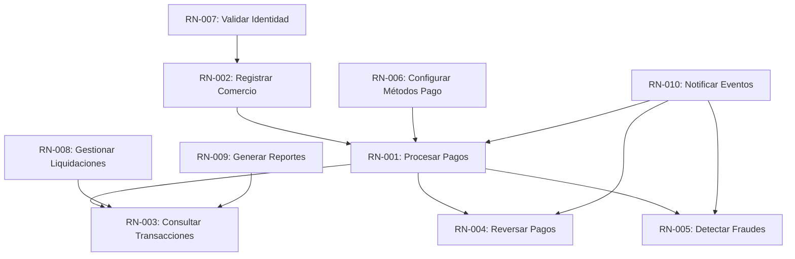
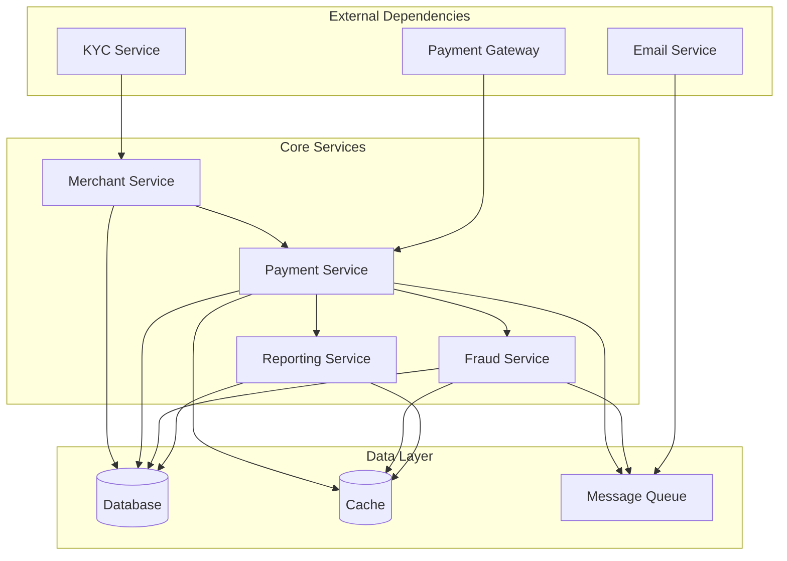

# ANÁLISIS DE DEPENDENCIAS DE REQUISITOS

## Escenario: Sistema de Procesamiento de Pagos para FinTech

**PROPÓSITO:**
Análisis detallado de las dependencias entre requisitos para optimizar la planificación, gestión de riesgos y secuenciación de desarrollo.

---

## 1. TIPOS DE DEPENDENCIAS

### 1.1 Dependencias Funcionales
Requisitos que dependen de la funcionalidad de otros para poder operar correctamente.

### 1.2 Dependencias Técnicas
Requisitos que comparten componentes tecnológicos o infraestructura.

### 1.3 Dependencias de Datos
Requisitos que dependen de datos generados por otros requisitos.

### 1.4 Dependencias de Proceso
Requisitos que deben seguir un orden específico en el flujo de negocio.

### 1.5 Dependencias Temporales
Requisitos que tienen restricciones de tiempo entre sí.

---

## 2. MAPA DE DEPENDENCIAS FUNCIONALES

### 2.1 Dependencias Directas



### 2.2 Análisis de Dependencias Críticas

#### RN-001 ← RN-002 (Procesar Pagos ← Registrar Comercio)
- **Tipo:** Prerrequisito Obligatorio
- **Descripción:** No se pueden procesar pagos sin un comercio registrado
- **Impacto:** Crítico - Bloquea funcionalidad principal
- **Mitigación:** Implementar validación estricta de comercio activo

```csharp
// Validación en PaymentService
public async Task<PaymentResult> ProcessPaymentAsync(PaymentRequest request)
{
    // Validar comercio registrado y activo
    var merchant = await _merchantService.GetActiveMerchantAsync(request.MerchantId);
    if (merchant == null || !merchant.IsActive)
    {
        return PaymentResult.Failed("Merchant not registered or inactive");
    }
    
    // Continuar con procesamiento...
}
```

#### RN-005 ← RN-001 (Detectar Fraudes ← Procesar Pagos)
- **Tipo:** Dependencia Paralela Crítica
- **Descripción:** La detección de fraudes debe ocurrir simultáneamente con el procesamiento
- **Impacto:** Crítico - Riesgo de seguridad
- **Mitigación:** Implementar validación síncrona y asíncrona

```csharp
// Procesamiento con validación de fraudes
public async Task<PaymentResult> ProcessPaymentAsync(PaymentRequest request)
{
    // Validación síncrona de fraudes (rápida)
    var quickFraudCheck = await _fraudService.QuickValidateAsync(request);
    if (quickFraudCheck.IsHighRisk)
    {
        return PaymentResult.Failed("Transaction blocked - fraud risk");
    }
    
    // Procesar pago
    var result = await _paymentProcessor.ProcessAsync(request);
    
    // Validación asíncrona de fraudes (detallada)
    _ = Task.Run(() => _fraudService.DetailedAnalysisAsync(request, result));
    
    return result;
}
```

---

## 3. ANÁLISIS DE DEPENDENCIAS TÉCNICAS

### 3.1 Dependencias de Infraestructura

| Componente | Requisitos Dependientes | Tipo de Dependencia | Riesgo |
|------------|------------------------|-------------------|--------|
| **Database** | RN-001, RN-002, RN-003, RN-004 | Compartida | Alto |
| **Message Queue** | RN-005, RN-008, RN-010 | Compartida | Medio |
| **Cache Layer** | RN-001, RN-003, RN-005 | Compartida | Medio |
| **Payment Gateway** | RN-001, RN-004 | Externa | Crítico |
| **KYC Service** | RN-002, RN-007 | Externa | Alto |

### 3.2 Dependencias de Servicios

```yaml
# Arquitectura de microservicios
services:
  merchant-service:
    depends_on: [database, kyc-service]
    supports: [RN-002, RN-007]
    
  payment-service:
    depends_on: [database, payment-gateway, fraud-service, merchant-service]
    supports: [RN-001, RN-004]
    
  fraud-service:
    depends_on: [database, ml-engine, cache]
    supports: [RN-005]
    
  reporting-service:
    depends_on: [database, cache, data-warehouse]
    supports: [RN-003, RN-008, RN-009]
    
  notification-service:
    depends_on: [message-queue, email-service]
    supports: [RN-010]
```

### 3.3 Dependencias de Datos

#### Flujo de Datos Principal
```sql
-- Secuencia de creación de datos
1. Merchant Registration (RN-002)
   → merchants table
   
2. Payment Processing (RN-001)
   → transactions table
   → payment_attempts table
   
3. Transaction Queries (RN-003)
   → transaction_summaries (derived)
   → merchant_analytics (derived)
   
4. Fraud Detection (RN-005)
   → fraud_scores table
   → blacklisted_entities table
   
5. Settlements (RN-008)
   → settlements table
   → merchant_balances table
```

#### Análisis de Dependencias de Datos
```csharp
// Validación de integridad referencial
public class DataDependencyValidator
{
    public async Task<bool> ValidatePaymentDependenciesAsync(PaymentRequest request)
    {
        // Validar existencia de comercio
        var merchantExists = await _merchantRepo.ExistsAsync(request.MerchantId);
        if (!merchantExists)
            return false;
            
        // Validar configuración de métodos de pago
        var paymentMethods = await _configRepo.GetPaymentMethodsAsync(request.MerchantId);
        if (!paymentMethods.Contains(request.PaymentMethod))
            return false;
            
        // Validar límites y restricciones
        var limits = await _limitsRepo.GetMerchantLimitsAsync(request.MerchantId);
        if (request.Amount > limits.MaxTransactionAmount)
            return false;
            
        return true;
    }
}
```

---

## 4. ANÁLISIS DE RIESGOS DE DEPENDENCIAS

### 4.1 Matriz de Riesgos

| Dependencia | Probabilidad Fallo | Impacto | Riesgo Total | Mitigación |
|-------------|-------------------|---------|-------------|------------|
| RN-001 ← Payment Gateway | Media | Crítico | Alto | Múltiples proveedores |
| RN-002 ← KYC Service | Baja | Alto | Medio | Cache de validaciones |
| RN-005 ← ML Engine | Media | Alto | Alto | Reglas de fallback |
| RN-003 ← Database | Baja | Crítico | Alto | Réplicas y backup |
| RN-010 ← Email Service | Alta | Bajo | Medio | Múltiples proveedores |

### 4.2 Estrategias de Mitigación

#### Dependencias Externas Críticas
```csharp
// Patrón Circuit Breaker para dependencias externas
public class PaymentGatewayService
{
    private readonly CircuitBreaker _circuitBreaker;
    private readonly IList<IPaymentGateway> _gateways;
    
    public async Task<PaymentResult> ProcessAsync(PaymentRequest request)
    {
        foreach (var gateway in _gateways)
        {
            if (_circuitBreaker.CanExecute(gateway.Name))
            {
                try
                {
                    var result = await gateway.ProcessAsync(request);
                    _circuitBreaker.OnSuccess(gateway.Name);
                    return result;
                }
                catch (Exception ex)
                {
                    _circuitBreaker.OnFailure(gateway.Name);
                    // Intentar siguiente gateway
                }
            }
        }
        
        return PaymentResult.Failed("All payment gateways unavailable");
    }
}
```

#### Dependencias de Datos
```csharp
// Patrón Repository con Cache para reducir dependencias
public class MerchantRepository
{
    private readonly ICache _cache;
    private readonly IDatabase _database;
    
    public async Task<Merchant> GetAsync(int merchantId)
    {
        // Intentar cache primero
        var cached = await _cache.GetAsync<Merchant>($"merchant:{merchantId}");
        if (cached != null)
            return cached;
            
        // Fallback a base de datos
        var merchant = await _database.QueryAsync<Merchant>(
            "SELECT * FROM merchants WHERE id = @id AND active = 1", 
            new { id = merchantId });
            
        if (merchant != null)
        {
            await _cache.SetAsync($"merchant:{merchantId}", merchant, TimeSpan.FromMinutes(15));
        }
        
        return merchant;
    }
}
```

---

## 5. SECUENCIACIÓN DE DESARROLLO

### 5.1 Fases de Desarrollo

#### Fase 1: Fundación (Sprints 1-3)
```
RN-002: Registrar Comercio
├── Base de datos principal
├── Servicios de autenticación
├── Validación KYC básica
└── Dashboard administrativo

RN-007: Validar Identidad
├── Integración con KYC provider
├── Workflow de aprobación
└── Notificaciones básicas
```

#### Fase 2: Core Payment (Sprints 4-7)
```
RN-001: Procesar Pagos
├── Integración con payment gateway
├── Validación de tarjetas
├── Procesamiento de transacciones
└── Manejo de errores

RN-006: Configurar Métodos Pago
├── Configuración por comercio
├── Validación de métodos
└── Gestión de restricciones
```

#### Fase 3: Seguridad y Análisis (Sprints 8-10)
```
RN-005: Detectar Fraudes
├── Reglas básicas de fraude
├── ML engine integration
├── Alertas en tiempo real
└── Dashboard de riesgos

RN-003: Consultar Transacciones
├── APIs de consulta
├── Filtros y búsquedas
├── Exportación de datos
└── Reportes básicos
```

#### Fase 4: Operaciones (Sprints 11-13)
```
RN-004: Reversar Pagos
├── Workflow de reversas
├── Validaciones de negocio
├── Integración con gateway
└── Notificaciones

RN-008: Gestionar Liquidaciones
├── Cálculo de comisiones
├── Programación de pagos
├── Conciliación bancaria
└── Reportes financieros
```

### 5.2 Dependencias entre Fases

```mermaid
gantt
    title Cronograma de Desarrollo
    dateFormat  X
    axisFormat %s
    
    section Fase 1
    Registrar Comercio    :done, p1, 0, 3
    Validar Identidad     :done, p2, 0, 3
    
    section Fase 2
    Procesar Pagos        :p3, after p1, 4
    Configurar Métodos    :p4, after p1, 2
    
    section Fase 3
    Detectar Fraudes      :p5, after p3, 3
    Consultar Transacciones :p6, after p3, 3
    
    section Fase 4
    Reversar Pagos        :p7, after p3, 3
    Gestionar Liquidaciones :p8, after p6, 3
```



---

## 6. GESTIÓN DE CAMBIOS EN DEPENDENCIAS

### 6.1 Proceso de Análisis de Impacto

```csharp
// Herramienta de análisis de impacto
public class DependencyImpactAnalyzer
{
    private readonly Dictionary<string, List<string>> _dependencies;
    
    public ImpactAnalysis AnalyzeChange(string changedRequirement)
    {
        var analysis = new ImpactAnalysis();
        
        // Analizar dependencias hacia adelante
        analysis.ForwardImpact = GetDependentRequirements(changedRequirement);
        
        // Analizar dependencias hacia atrás
        analysis.BackwardImpact = GetRequirementDependencies(changedRequirement);
        
        // Calcular esfuerzo estimado
        analysis.EstimatedEffort = CalculateEffort(analysis);
        
        // Identificar riesgos
        analysis.Risks = IdentifyRisks(analysis);
        
        return analysis;
    }
    
    private List<string> GetDependentRequirements(string requirement)
    {
        var dependents = new List<string>();
        
        foreach (var kvp in _dependencies)
        {
            if (kvp.Value.Contains(requirement))
            {
                dependents.Add(kvp.Key);
                // Recursivamente encontrar dependencias transitivas
                dependents.AddRange(GetDependentRequirements(kvp.Key));
            }
        }
        
        return dependents.Distinct().ToList();
    }
}
```

### 6.2 Matriz de Impacto de Cambios

| Requisito Modificado | Impacto Directo | Impacto Indirecto | Esfuerzo | Riesgo |
|---------------------|-----------------|------------------|----------|--------|
| RN-001 (Procesar Pagos) | RN-003, RN-004, RN-005 | RN-008, RN-009 | Alto | Crítico |
| RN-002 (Registrar Comercio) | RN-001 | RN-003, RN-004, RN-005 | Medio | Alto |
| RN-005 (Detectar Fraudes) | RN-001 | Ninguno | Bajo | Medio |
| NFR-001 (Performance) | RN-001, RN-003 | RN-004, RN-005 | Alto | Alto |

---

## 7. OPTIMIZACIÓN DE DEPENDENCIAS

### 7.1 Identificación de Dependencias Innecesarias

```csharp
// Análisis de dependencias débiles
public class DependencyOptimizer
{
    public OptimizationReport AnalyzeDependencies()
    {
        var report = new OptimizationReport();
        
        // Identificar dependencias circulares
        report.CircularDependencies = FindCircularDependencies();
        
        // Identificar dependencias débiles
        report.WeakDependencies = FindWeakDependencies();
        
        // Sugerir optimizaciones
        report.OptimizationSuggestions = GenerateOptimizationSuggestions();
        
        return report;
    }
    
    private List<string> FindWeakDependencies()
    {
        // Dependencias que pueden ser eliminadas o refactorizadas
        return new List<string>
        {
            "RN-010 → RN-001", // Notificaciones pueden ser asíncronas
            "RN-009 → RN-003", // Reportes pueden usar datos históricos
            "RN-006 → RN-002"  // Configuración puede ser opcional
        };
    }
}
```

### 7.2 Estrategias de Desacoplamiento

#### Event-Driven Architecture
```csharp
// Desacoplamiento mediante eventos
public class PaymentProcessedEvent
{
    public string TransactionId { get; set; }
    public decimal Amount { get; set; }
    public string MerchantId { get; set; }
    public DateTime ProcessedAt { get; set; }
}

// Servicios que reaccionan a eventos
public class FraudDetectionService
{
    public async Task HandlePaymentProcessed(PaymentProcessedEvent evt)
    {
        // Análisis de fraudes asíncrono
        await AnalyzeTransactionAsync(evt.TransactionId);
    }
}

public class ReportingService
{
    public async Task HandlePaymentProcessed(PaymentProcessedEvent evt)
    {
        // Actualizar métricas y reportes
        await UpdateMerchantMetricsAsync(evt.MerchantId, evt.Amount);
    }
}
```

#### Dependency Injection
```csharp
// Inversión de dependencias
public interface IPaymentGateway
{
    Task<PaymentResult> ProcessAsync(PaymentRequest request);
}

public class PaymentService
{
    private readonly IPaymentGateway _gateway;
    private readonly IFraudDetectionService _fraudService;
    
    public PaymentService(IPaymentGateway gateway, IFraudDetectionService fraudService)
    {
        _gateway = gateway;
        _fraudService = fraudService;
    }
    
    // Implementación sin dependencias hardcodeadas
}
```

---

## 8. MONITOREO DE DEPENDENCIAS

### 8.1 Métricas de Salud de Dependencias

```csharp
// Monitoreo de dependencias en tiempo real
public class DependencyHealthMonitor
{
    private readonly Dictionary<string, DependencyHealth> _healthStatus;
    
    public async Task<DependencyHealth> GetHealthAsync(string dependency)
    {
        switch (dependency)
        {
            case "PaymentGateway":
                return await CheckPaymentGatewayHealth();
            case "KYCService":
                return await CheckKYCServiceHealth();
            case "Database":
                return await CheckDatabaseHealth();
            default:
                return DependencyHealth.Unknown;
        }
    }
    
    private async Task<DependencyHealth> CheckPaymentGatewayHealth()
    {
        try
        {
            var response = await _httpClient.GetAsync("/health");
            var latency = response.Headers.GetValues("X-Response-Time").FirstOrDefault();
            
            return new DependencyHealth
            {
                Status = response.IsSuccessStatusCode ? "Healthy" : "Unhealthy",
                Latency = TimeSpan.Parse(latency),
                LastChecked = DateTime.UtcNow
            };
        }
        catch (Exception ex)
        {
            return new DependencyHealth
            {
                Status = "Unhealthy",
                Error = ex.Message,
                LastChecked = DateTime.UtcNow
            };
        }
    }
}
```

### 8.2 Dashboard de Dependencias

```javascript
// Dashboard de estado de dependencias
const dependencyStatus = {
    "payment-gateway": {
        status: "healthy",
        latency: "45ms",
        uptime: "99.9%",
        affectedRequirements: ["RN-001", "RN-004"]
    },
    "kyc-service": {
        status: "degraded",
        latency: "250ms",
        uptime: "97.5%",
        affectedRequirements: ["RN-002", "RN-007"]
    },
    "database": {
        status: "healthy",
        latency: "5ms",
        uptime: "99.99%",
        affectedRequirements: ["RN-001", "RN-002", "RN-003"]
    }
};
```

---

## 9. DOCUMENTACIÓN DE DEPENDENCIAS

### 9.1 Registro de Dependencias

```yaml
# dependency-registry.yml
dependencies:
  RN-001:
    name: "Procesar Pagos"
    requires:
      - id: "RN-002"
        name: "Registrar Comercio"
        type: "prerequisite"
        criticality: "high"
    provides:
      - id: "transaction-data"
        name: "Datos de Transacciones"
        type: "data"
        consumers: ["RN-003", "RN-004", "RN-005"]
    external_dependencies:
      - name: "Payment Gateway"
        type: "service"
        sla: "99.9%"
        fallback: "secondary-gateway"
```

### 9.2 Diagramas de Dependencias



---

## 10. CONCLUSIONES Y RECOMENDACIONES

### 10.1 Hallazgos Principales

1. **Dependencias Críticas Identificadas:**
   - RN-001 (Procesar Pagos) es el requisito más crítico
   - RN-002 (Registrar Comercio) es prerequisito fundamental
   - Dependencias externas presentan mayor riesgo

2. **Oportunidades de Optimización:**
   - Implementar arquitectura orientada a eventos
   - Reducir dependencias síncronas
   - Mejorar estrategias de fallback

3. **Riesgos Principales:**
   - Dependencias externas críticas sin fallback
   - Posibles dependencias circulares
   - Falta de monitoreo en tiempo real

### 10.2 Recomendaciones

1. **Arquitectura:**
   - Implementar patrones de resiliencia
   - Usar Event-Driven Architecture
   - Aplicar principios de Domain-Driven Design

2. **Operaciones:**
   - Monitoreo continuo de dependencias
   - Alertas proactivas de degradación
   - Runbooks para manejo de fallos

3. **Desarrollo:**
   - Implementar dependency injection
   - Crear interfaces para dependencias externas
   - Mantener documentación actualizada

---

**HERRAMIENTAS RECOMENDADAS:**
- **Análisis:** SonarQube, NDepend, Dependency-Track
- **Monitoreo:** Prometheus, Grafana, New Relic
- **Documentación:** PlantUML, Mermaid, Lucidchart
- **Testing:** Chaos Engineering, Circuit Breaker patterns

**PRÓXIMOS PASOS:**
1. Implementar monitoreo de dependencias
2. Crear estrategias de fallback
3. Documentar todos los runbooks
4. Establecer métricas de salud