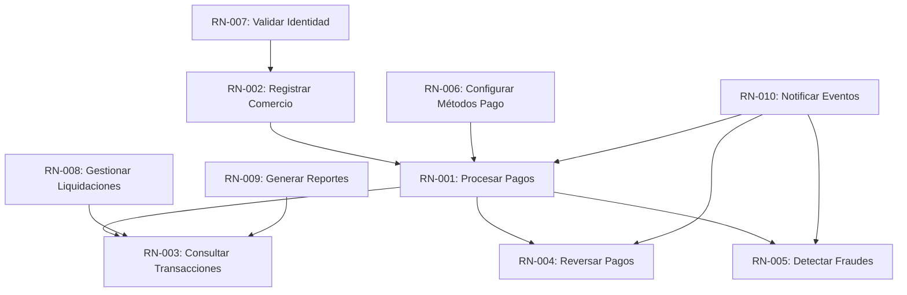
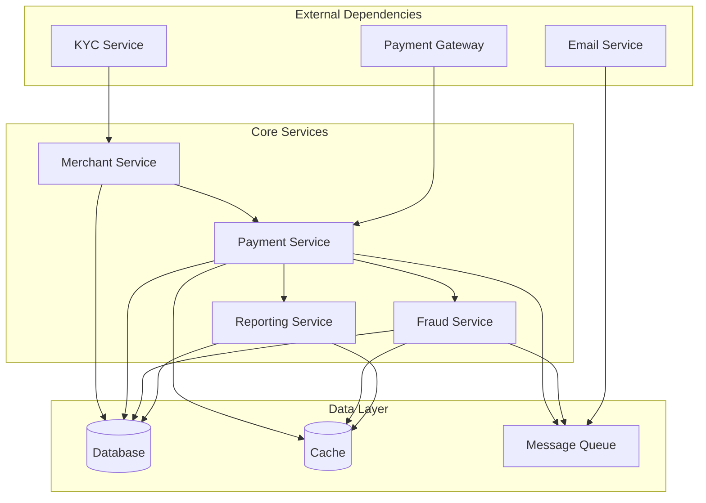

# ANÁLISIS DE DEPENDENCIAS DE REQUISITOS

## Escenario: Sistema de Procesamiento de Pagos para FinTech

**PROPÓSITO:**
Análisis detallado de las dependencias entre requisitos para optimizar la planificación, gestión de riesgos y secuenciación de desarrollo.

---

## 1. TIPOS DE DEPENDENCIAS

### 1.1 Dependencias Funcionales
Requisitos que dependen de la funcionalidad de otros para poder operar correctamente.

### 1.2 Dependencias Técnicas
Requisitos que comparten componentes tecnológicos o infraestructura.

### 1.3 Dependencias de Datos
Requisitos que dependen de datos generados por otros requisitos.

### 1.4 Dependencias de Proceso
Requisitos que deben seguir un orden específico en el flujo de negocio.

### 1.5 Dependencias Temporales
Requisitos que tienen restricciones de tiempo entre sí.

---

## 2. MAPA DE DEPENDENCIAS FUNCIONALES

### 2.1 Dependencias Directas



### 2.2 Análisis de Dependencias Críticas

#### RN-001 ← RN-002 (Procesar Pagos ← Registrar Comercio)
- **Tipo:** Prerrequisito Obligatorio
- **Descripción:** No se pueden procesar pagos sin un comercio registrado
- **Impacto:** Crítico - Bloquea funcionalidad principal
- **Mitigación:** Implementar validación estricta de comercio activo

**Pseudocódigo - Validación de Comercio:**
```
FUNCIÓN ProcesarPago(solicitudPago)
    // Validar comercio registrado y activo
    comercio = ObtenerComercioActivo(solicitudPago.IdComercio)
    SI comercio ES NULO O NO comercio.Activo ENTONCES
        RETORNAR Error("Comercio no registrado o inactivo")
    FIN SI
    
    // Continuar con procesamiento
END FUNCIÓN
```

#### RN-005 ← RN-001 (Detectar Fraudes ← Procesar Pagos)
- **Tipo:** Dependencia Paralela Crítica
- **Descripción:** La detección de fraudes debe ocurrir simultáneamente con el procesamiento
- **Impacto:** Crítico - Riesgo de seguridad
- **Mitigación:** Implementar validación síncrona y asíncrona

**Proceso de Validación de Fraudes:**
```
FUNCIÓN ProcesarPago(solicitudPago)
    // 1. Validación síncrona de fraudes (rápida)
    verificaciónRápida = ValidaciónRápidaFraude(solicitudPago)
    SI verificaciónRápida.RiesgoAlto ENTONCES
        RETORNAR Error("Transacción bloqueada - riesgo de fraude")
    FIN SI
    
    // 2. Procesar pago
    resultado = ProcesarTransacción(solicitudPago)
    
    // 3. Validación asíncrona de fraudes (detallada)
    EjecutarEnSegundoPlano(AnálisisDetalladoFraude(solicitudPago, resultado))
    
    RETORNAR resultado
FIN FUNCIÓN
```

---

## 3. ANÁLISIS DE DEPENDENCIAS TÉCNICAS

### 3.1 Dependencias de Infraestructura

| Componente | Requisitos Dependientes | Tipo de Dependencia | Riesgo |
|------------|------------------------|-------------------|--------|
| **Database** | RN-001, RN-002, RN-003, RN-004 | Compartida | Alto |
| **Message Queue** | RN-005, RN-008, RN-010 | Compartida | Medio |
| **Cache Layer** | RN-001, RN-003, RN-005 | Compartida | Medio |
| **Payment Gateway** | RN-001, RN-004 | Externa | Crítico |
| **KYC Service** | RN-002, RN-007 | Externa | Alto |

### 3.2 Dependencias de Servicios

```yaml
# Arquitectura de microservicios
services:
  merchant-service:
    depends_on: [database, kyc-service]
    supports: [RN-002, RN-007]
    
  payment-service:
    depends_on: [database, payment-gateway, fraud-service, merchant-service]
    supports: [RN-001, RN-004]
    
  fraud-service:
    depends_on: [database, ml-engine, cache]
    supports: [RN-005]
    
  reporting-service:
    depends_on: [database, cache, data-warehouse]
    supports: [RN-003, RN-008, RN-009]
    
  notification-service:
    depends_on: [message-queue, email-service]
    supports: [RN-010]
```

### 3.3 Dependencias de Datos

#### Flujo de Datos Principal
```sql
-- Secuencia de creación de datos
1. Merchant Registration (RN-002)
   → merchants table
   
2. Payment Processing (RN-001)
   → transactions table
   → payment_attempts table
   
3. Transaction Queries (RN-003)
   → transaction_summaries (derived)
   → merchant_analytics (derived)
   
4. Fraud Detection (RN-005)
   → fraud_scores table
   → blacklisted_entities table
   
5. Settlements (RN-008)
   → settlements table
   → merchant_balances table
```

#### Análisis de Dependencias de Datos
**Checklist de Validación de Datos:**

1. **Validación de Integridad Referencial**
   - [ ] Verificar existencia del comercio en la base de datos
   - [ ] Comprobar que el comercio está activo
   - [ ] Validar que el método de pago está configurado para el comercio
   - [ ] Verificar que el monto está dentro de los límites permitidos
   - [ ] Comprobar que la cuenta del cliente existe (si aplica)
   - [ ] Validar restricciones geográficas (si aplica)

**Proceso de Validación de Datos:**
```
FUNCIÓN ValidarDependenciasTransacción(solicitudPago)
    // 1. Validar existencia de comercio
    SI NO ExisteComercio(solicitudPago.IdComercio) ENTONCES
        RETORNAR Falso
    FIN SI
    
    // 2. Validar métodos de pago configurados
    métodosPago = ObtenerMétodosPago(solicitudPago.IdComercio)
    SI NO métodosPago.Contiene(solicitudPago.MétodoPago) ENTONCES
        RETORNAR Falso
    FIN SI
    
    // 3. Validar límites de monto
    límites = ObtenerLímites(solicitudPago.IdComercio)
    SI solicitudPago.Monto > límites.MontoMáximo ENTONCES
        RETORNAR Falso
    FIN SI
    
    RETORNAR Verdadero
FIN FUNCIÓN
```

---

## 4. ANÁLISIS DE RIESGOS DE DEPENDENCIAS

### 4.1 Matriz de Riesgos

| Dependencia | Probabilidad Fallo | Impacto | Riesgo Total | Mitigación |
|-------------|-------------------|---------|-------------|------------|
| RN-001 ← Payment Gateway | Media | Crítico | Alto | Múltiples proveedores |
| RN-002 ← KYC Service | Baja | Alto | Medio | Cache de validaciones |
| RN-005 ← ML Engine | Media | Alto | Alto | Reglas de fallback |
| RN-003 ← Database | Baja | Crítico | Alto | Réplicas y backup |
| RN-010 ← Email Service | Alta | Bajo | Medio | Múltiples proveedores |

### 4.2 Estrategias de Mitigación

#### Dependencias Externas Críticas
**Estrategia de Mitigación - Patrón Circuit Breaker:**

**Descripción:** Implementación de un mecanismo de protección para dependencias externas que permite:
- Detectar fallos en servicios externos
- Evitar llamadas innecesarias a servicios no disponibles
- Redirigir tráfico a proveedores alternativos
- Restaurar automáticamente la conexión cuando el servicio se restablece

**Diagrama de Flujo:**
```
PROCESO ProcesarPagoConCircuitBreaker(solicitudPago)
    PARA CADA gateway EN listaGateways HACER
        SI circuitBreaker.PuedeEjecutar(gateway.Nombre) ENTONCES
            INTENTAR
                resultado = gateway.Procesar(solicitudPago)
                circuitBreaker.MarcarÉxito(gateway.Nombre)
                RETORNAR resultado
            EXCEPCIÓN
                circuitBreaker.MarcarError(gateway.Nombre)
                // Continuar con el siguiente gateway
            FIN INTENTAR
        FIN SI
    FIN PARA
    
    RETORNAR Error("Todos los gateways de pago no disponibles")
FIN PROCESO
```

**Implementación recomendada:**
- Usar biblioteca especializada (Polly, Hystrix, etc.)
- Configurar timeouts adecuados para cada servicio externo
- Definir umbrales de fallos según criticidad del servicio
- Implementar estrategia de backoff exponencial para reintentos

#### Dependencias de Datos
**Estrategia de Desacoplamiento - Cache y Repository:**

**Objetivo:** Reducir dependencias directas de datos mediante caché y abstraer el acceso a los datos

**Funcionamiento:**
1. Intentar primero recuperar datos del caché (alta velocidad)
2. Si no existe en caché, obtener de la base de datos
3. Almacenar resultado en caché con tiempo de expiración
4. Abstraer los detalles de acceso a datos del resto de la aplicación

**Ejemplo de Flujo:**
```
FUNCIÓN ObtenerComercio(idComercio)
    // 1. Intentar recuperar de caché primero
    comercioEnCache = Caché.Obtener("comercio:" + idComercio)
    SI comercioEnCache NO ES NULO ENTONCES
        RETORNAR comercioEnCache
    FIN SI
    
    // 2. Fallback a base de datos
    comercio = BaseDatos.Consultar("SELECT * FROM comercios WHERE id = ? AND activo = 1", idComercio)
    
    // 3. Almacenar en caché si se encontró
    SI comercio NO ES NULO ENTONCES
        Caché.Establecer("comercio:" + idComercio, comercio, 15 MINUTOS)
    FIN SI
    
    RETORNAR comercio
FIN FUNCIÓN
```

**Beneficios:**
- Reduce carga en la base de datos
- Mejora tiempos de respuesta
- Provee resiliencia ante fallos temporales
- Facilita pruebas unitarias

---

## 5. SECUENCIACIÓN DE DESARROLLO

### 5.1 Fases de Desarrollo

#### Fase 1: Fundación (Sprints 1-3)
```
RN-002: Registrar Comercio
├── Base de datos principal
├── Servicios de autenticación
├── Validación KYC básica
└── Dashboard administrativo

RN-007: Validar Identidad
├── Integración con KYC provider
├── Workflow de aprobación
└── Notificaciones básicas
```

#### Fase 2: Core Payment (Sprints 4-7)
```
RN-001: Procesar Pagos
├── Integración con payment gateway
├── Validación de tarjetas
├── Procesamiento de transacciones
└── Manejo de errores

RN-006: Configurar Métodos Pago
├── Configuración por comercio
├── Validación de métodos
└── Gestión de restricciones
```

#### Fase 3: Seguridad y Análisis (Sprints 8-10)
```
RN-005: Detectar Fraudes
├── Reglas básicas de fraude
├── ML engine integration
├── Alertas en tiempo real
└── Dashboard de riesgos

RN-003: Consultar Transacciones
├── APIs de consulta
├── Filtros y búsquedas
├── Exportación de datos
└── Reportes básicos
```

#### Fase 4: Operaciones (Sprints 11-13)
```
RN-004: Reversar Pagos
├── Workflow de reversas
├── Validaciones de negocio
├── Integración con gateway
└── Notificaciones

RN-008: Gestionar Liquidaciones
├── Cálculo de comisiones
├── Programación de pagos
├── Conciliación bancaria
└── Reportes financieros
```

### 5.2 Dependencias entre Fases

```mermaid
gantt
    title Cronograma de Desarrollo
    dateFormat  X
    axisFormat %s
    
    section Fase 1
    Registrar Comercio    :done, p1, 0, 3
    Validar Identidad     :done, p2, 0, 3
    
    section Fase 2
    Procesar Pagos        :p3, after p1, 4
    Configurar Métodos    :p4, after p1, 2
    
    section Fase 3
    Detectar Fraudes      :p5, after p3, 3
    Consultar Transacciones :p6, after p3, 3
    
    section Fase 4
    Reversar Pagos        :p7, after p3, 3
    Gestionar Liquidaciones :p8, after p6, 3
```



---

## 6. GESTIÓN DE CAMBIOS EN DEPENDENCIAS

### 6.1 Proceso de Análisis de Impacto

**Proceso de Análisis de Impacto de Cambios:**

**Objetivo:** Evaluar sistemáticamente el impacto de modificar un requisito en el resto del sistema

**Metodología:**
1. Identificar requisitos afectados directamente
2. Determinar impacto en cadena (dependencias transitivas)
3. Estimar esfuerzo necesario para implementar cambios
4. Identificar riesgos asociados al cambio

**Checklist de Análisis de Impacto:**
- [ ] Identificar el requisito a modificar
- [ ] Analizar dependencias hacia adelante (quién depende de este requisito)
- [ ] Analizar dependencias hacia atrás (de quién depende este requisito)
- [ ] Calcular métricas de impacto:
  - [ ] Cantidad de componentes afectados
  - [ ] Criticidad de los componentes afectados
  - [ ] Esfuerzo estimado de modificación
- [ ] Documentar riesgos identificados
- [ ] Proponer estrategia de mitigación

**Algoritmo de Análisis:**
```
FUNCIÓN AnalizarImpactoCambio(requisitoModificado)
    análisis = NuevoAnálisisImpacto()
    
    // 1. Analizar impacto hacia adelante (dependientes)
    análisis.ImpactoAdelante = ObtenerRequisitosQueDependenDe(requisitoModificado)
    
    // 2. Analizar impacto hacia atrás (dependencias)
    análisis.ImpactoAtrás = ObtenerRequisitosDeQueDepende(requisitoModificado)
    
    // 3. Calcular esfuerzo estimado
    análisis.EsfuerzoEstimado = CalcularEsfuerzo(análisis)
    
    // 4. Identificar riesgos
    análisis.Riesgos = IdentificarRiesgos(análisis)
    
    RETORNAR análisis
FIN FUNCIÓN
```

### 6.2 Matriz de Impacto de Cambios

| Requisito Modificado | Impacto Directo | Impacto Indirecto | Esfuerzo | Riesgo |
|---------------------|-----------------|------------------|----------|--------|
| RN-001 (Procesar Pagos) | RN-003, RN-004, RN-005 | RN-008, RN-009 | Alto | Crítico |
| RN-002 (Registrar Comercio) | RN-001 | RN-003, RN-004, RN-005 | Medio | Alto |
| RN-005 (Detectar Fraudes) | RN-001 | Ninguno | Bajo | Medio |
| NFR-001 (Performance) | RN-001, RN-003 | RN-004, RN-005 | Alto | Alto |

---

## 7. OPTIMIZACIÓN DE DEPENDENCIAS

### 7.1 Identificación de Dependencias Innecesarias

**Optimización de Dependencias:**

**Objetivo:** Identificar y resolver dependencias innecesarias o problemáticas en el sistema

**Tipos de dependencias a optimizar:**

1. **Dependencias Circulares:**
   - Componentes que dependen mutuamente entre sí
   - Dificultan pruebas y mantenimiento
   - Generan acoplamiento fuerte

2. **Dependencias Débiles:**
   - Conexiones que podrían eliminarse o hacerse asíncronas
   - Dependencias que no son críticas para la función principal
   - Relaciones que pueden ser refactorizadas

3. **Dependencias Implícitas:**
   - Conexiones no documentadas entre componentes
   - Asunciones sobre comportamiento de otros módulos
   - Dependencias ocultas de configuración o recursos

**Candidatos para Optimización:**
- RN-010 → RN-001: Las notificaciones pueden ser asíncronas
- RN-009 → RN-003: Los reportes pueden usar datos históricos/replicados
- RN-006 → RN-002: La configuración de métodos puede ser opcional

**Proceso de Optimización:**
```
FUNCIÓN AnalizarOptimizaciones()
    reporte = NuevoReporteOptimización()
    
    // 1. Identificar dependencias circulares
    reporte.DependenciasCirculares = EncontrarDependenciasCirculares()
    
    // 2. Identificar dependencias débiles
    reporte.DependenciasDebiles = EncontrarDependenciasDebiles()
    
    // 3. Generar sugerencias de optimización
    reporte.SugerenciasOptimizacion = GenerarSugerenciasOptimizacion()
    
    RETORNAR reporte
FIN FUNCIÓN
```

### 7.2 Estrategias de Desacoplamiento

#### Event-Driven Architecture
**Arquitectura Orientada a Eventos (Event-Driven):**

**Objetivo:** Desacoplar servicios mediante el uso de eventos y mensajería asíncrona

**Componentes principales:**
1. **Eventos de Dominio:** Representan hechos ocurridos en el sistema
2. **Publicadores:** Servicios que generan eventos cuando ocurren cambios
3. **Suscriptores:** Servicios que reaccionan a eventos específicos
4. **Bus de Eventos:** Infraestructura que conecta publicadores y suscriptores

**Ejemplo - Evento de Pago Procesado:**
```
ESTRUCTURA EventoPagoProcesado
    IdTransaccion: texto
    Monto: decimal
    IdComercio: texto
    FechaProcesado: fecha/hora
FIN ESTRUCTURA
```

**Flujo de Procesamiento Desacoplado:**
```
// Servicio de Detección de Fraudes
FUNCIÓN ManejarPagoProcesado(evento)
    // Análisis asíncrono de transacción para detectar fraudes
    AnalizarTransaccionAsincrono(evento.IdTransaccion)
FIN FUNCIÓN

// Servicio de Reportes
FUNCIÓN ManejarPagoProcesado(evento)
    // Actualizar métricas y reportes con la información del pago
    ActualizarMetricasComercio(evento.IdComercio, evento.Monto)
FIN FUNCIÓN
```

**Beneficios:**
- Reduce acoplamiento entre servicios
- Mejora escalabilidad y resiliencia
- Facilita evolución independiente de componentes
- Permite implementar CQRS y Event Sourcing

#### Dependency Injection
**Patrón de Inversión de Dependencias:**

**Objetivo:** Reducir acoplamiento entre componentes mediante abstracciones e inyección de dependencias

**Principios:**
1. Los módulos de alto nivel no deben depender de módulos de bajo nivel
2. Ambos deben depender de abstracciones
3. Las abstracciones no deben depender de detalles
4. Los detalles deben depender de abstracciones

**Estructura:**
```
INTERFAZ IGatewayPago
    FUNCIÓN ProcesarPago(solicitud): ResultadoPago
FIN INTERFAZ

CLASE ServicioPago
    ATRIBUTOS:
        gateway: IGatewayPago
        servicioFraude: IServicioDeteccionFraude
    
    CONSTRUCTOR(gateway, servicioFraude)
        this.gateway = gateway
        this.servicioFraude = servicioFraude
    FIN CONSTRUCTOR
    
    // Implementación que utiliza las interfaces inyectadas
FIN CLASE
```

**Beneficios:**
- Facilita cambiar implementaciones sin modificar el código cliente
- Mejora la testeabilidad mediante mocks/stubs
- Reduce acoplamiento entre componentes
- Favorece el principio de responsabilidad única

---

## 8. MONITOREO DE DEPENDENCIAS

### 8.1 Métricas de Salud de Dependencias

**Sistema de Monitoreo de Dependencias:**

**Objetivo:** Proporcionar visibilidad en tiempo real sobre el estado de las dependencias críticas

**Métricas clave a monitorear:**
1. Estado operativo (activo/degradado/inactivo)
2. Latencia de respuesta
3. Tasa de errores
4. Tiempo desde la última verificación exitosa
5. Uso de recursos (CPU, memoria, conexiones)

**Proceso de Monitoreo:**
```
FUNCIÓN ObtenerEstadoDependencia(nombreDependencia)
    SEGÚN nombreDependencia
        CASO "GatewayPago":
            RETORNAR VerificarEstadoGatewayPago()
        CASO "ServicioKYC":
            RETORNAR VerificarEstadoServicioKYC()
        CASO "BaseDatos":
            RETORNAR VerificarEstadoBaseDatos()
        OTRO:
            RETORNAR EstadoDesconocido
    FIN SEGÚN
FIN FUNCIÓN
```

**Verificación de Estado de Servicio:**
```
FUNCIÓN VerificarEstadoGatewayPago()
    INTENTAR
        respuesta = EnviarSolicitudHTTP("/health")
        latencia = ObtenerCabecera(respuesta, "X-Response-Time")
        
        SI respuesta.EsExitosa ENTONCES
            estadoDependencia = NuevoEstadoDependencia(
                Estado: "Saludable",
                Latencia: latencia,
                UltimaVerificación: AhoraUTC
            )
        SINO
            estadoDependencia = NuevoEstadoDependencia(
                Estado: "No Saludable",
                Latencia: latencia,
                UltimaVerificación: AhoraUTC
            )
        FIN SI
    EXCEPCIÓN error
        estadoDependencia = NuevoEstadoDependencia(
            Estado: "No Saludable",
            Error: error.Mensaje,
            UltimaVerificación: AhoraUTC
        )
    FIN INTENTAR
    
    RETORNAR estadoDependencia
FIN FUNCIÓN
```

**Checklist de implementación:**
- [ ] Endpoints de health check para cada servicio
- [ ] Sistema centralizado de registro de métricas
- [ ] Alertas configuradas para umbrales críticos
- [ ] Dashboard en tiempo real
- [ ] Historial de incidentes

### 8.2 Dashboard de Dependencias

**Dashboard de Estado de Dependencias:**

**Propósito:** Visualización en tiempo real del estado de todas las dependencias del sistema

**Información a mostrar para cada dependencia:**

| Dependencia | Estado | Latencia | Disponibilidad | Requisitos Afectados |
|-------------|--------|----------|----------------|----------------------|
| **Gateway de Pago** | Saludable | 45ms | 99.9% | RN-001, RN-004 |
| **Servicio KYC** | Degradado | 250ms | 97.5% | RN-002, RN-007 |
| **Base de Datos** | Saludable | 5ms | 99.99% | RN-001, RN-002, RN-003 |

**Estructura del Modelo de Datos:**
```
ESTRUCTURA EstadoDependencias
    gateway_pago: {
        estado: "saludable",
        latencia: "45ms",
        disponibilidad: "99.9%",
        requisitos_afectados: ["RN-001", "RN-004"]
    },
    servicio_kyc: {
        estado: "degradado",
        latencia: "250ms",
        disponibilidad: "97.5%",
        requisitos_afectados: ["RN-002", "RN-007"]
    },
    base_datos: {
        estado: "saludable",
        latencia: "5ms",
        disponibilidad: "99.99%",
        requisitos_afectados: ["RN-001", "RN-002", "RN-003"]
    }
FIN ESTRUCTURA
```

**Funcionalidad Recomendada:**
- Actualización automática cada 30 segundos
- Histórico de estado (últimas 24 horas)
- Notificaciones visuales para cambios de estado
- Drill-down para ver métricas detalladas
- Vista de impacto en requisitos de negocio

---

## 9. DOCUMENTACIÓN DE DEPENDENCIAS

### 9.1 Registro de Dependencias

**Registro de Dependencias:**

**Propósito:** Documentación estructurada de todas las dependencias entre requisitos y componentes

**Estructura del Registro:**

```
REGISTRO DE DEPENDENCIAS

REQUISITO: RN-001 - Procesar Pagos
  REQUIERE:
    - ID: "RN-002"
      NOMBRE: "Registrar Comercio"
      TIPO: "prerrequisito"
      CRITICIDAD: "alta"
  PROPORCIONA:
    - ID: "transaction-data"
      NOMBRE: "Datos de Transacciones"
      TIPO: "datos"
      CONSUMIDORES: ["RN-003", "RN-004", "RN-005"]
  DEPENDENCIAS EXTERNAS:
    - NOMBRE: "Gateway de Pagos"
      TIPO: "servicio"
      SLA: "99.9%"
      RESPALDO: "gateway-secundario"
```

**Elementos a documentar:**
- Relaciones entre requisitos (requiere/proporciona)
- Criticidad de las dependencias
- Flujos de datos entre componentes
- Dependencias externas y sus SLAs
- Estrategias de respaldo/fallback

### 9.2 Diagramas de Dependencias



---

## 10. CONCLUSIONES Y RECOMENDACIONES

### 10.1 Hallazgos Principales

1. **Dependencias Críticas Identificadas:**
   - RN-001 (Procesar Pagos) es el requisito más crítico
   - RN-002 (Registrar Comercio) es prerequisito fundamental
   - Dependencias externas presentan mayor riesgo

2. **Oportunidades de Optimización:**
   - Implementar arquitectura orientada a eventos
   - Reducir dependencias síncronas
   - Mejorar estrategias de fallback

3. **Riesgos Principales:**
   - Dependencias externas críticas sin fallback
   - Posibles dependencias circulares
   - Falta de monitoreo en tiempo real

### 10.2 Recomendaciones

1. **Arquitectura:**
   - Implementar patrones de resiliencia
   - Usar Event-Driven Architecture
   - Aplicar principios de Domain-Driven Design

2. **Operaciones:**
   - Monitoreo continuo de dependencias
   - Alertas proactivas de degradación
   - Runbooks para manejo de fallos

3. **Desarrollo:**
   - Implementar dependency injection
   - Crear interfaces para dependencias externas
   - Mantener documentación actualizada

---

**HERRAMIENTAS RECOMENDADAS:**
- **Análisis:** SonarQube, NDepend, Dependency-Track
- **Monitoreo:** Prometheus, Grafana, New Relic
- **Documentación:** PlantUML, Mermaid, Lucidchart
- **Testing:** Chaos Engineering, Circuit Breaker patterns

**PRÓXIMOS PASOS:**
1. Implementar monitoreo de dependencias
2. Crear estrategias de fallback
3. Documentar todos los runbooks
4. Establecer métricas de salud