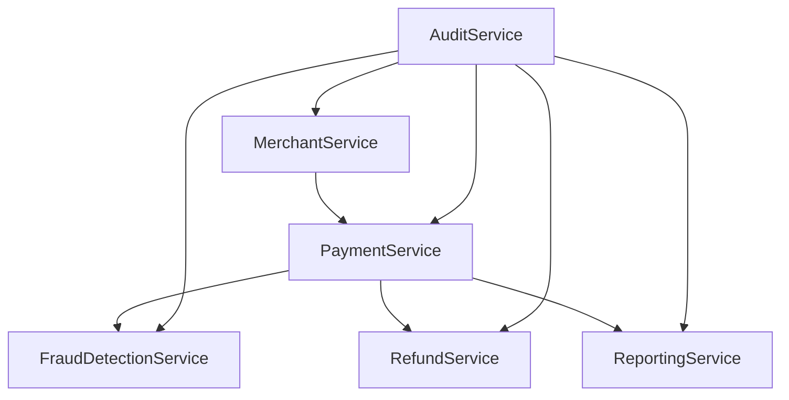

# EJERCICIO 4: Matriz de Trazabilidad de Requisitos

## Escenario: Sistema de Procesamiento de Pagos para FinTech

**PROPÓSITO:**
Establecer la trazabilidad completa entre requisitos de negocio, casos de uso, historias de usuario, componentes técnicos y pruebas de validación.

---

## 1. DEFINICIÓN DE TRAZABILIDAD

### 1.1 ¿Qué es la Trazabilidad?
La trazabilidad es la capacidad de seguir y documentar las relaciones entre diferentes elementos del proyecto, desde requisitos de negocio hasta implementación técnica.

### 1.2 Beneficios de la Trazabilidad:
- **Gestión de Cambios:** Evaluar impacto de modificaciones
- **Validación:** Verificar que todos los requisitos están implementados
- **Auditoría:** Demostrar cumplimiento regulatorio
- **Mantenimiento:** Facilitar evolución del sistema
- **Cobertura:** Asegurar testing completo

### 1.3 Niveles de Trazabilidad:
- **Horizontal:** Entre elementos del mismo nivel
- **Vertical:** Entre diferentes niveles de abstracción
- **Bidireccional:** Forward y backward tracing

---

## 2. MATRIZ DE TRAZABILIDAD PRINCIPAL

### 2.1 Estructura de la Matriz

| ID | Requisito de Negocio | Caso de Uso | User Story | Componente Técnico | Prueba | Estado |
|----|---------------------|-------------|------------|-------------------|--------|--------|
| RN-001 | Procesar pagos seguros | CU-001 | US-001 | PaymentService | PT-001 | ✅ |
| RN-002 | Registrar comercios | CU-002 | US-004 | MerchantService | PT-002 | ✅ |
| RN-003 | Consultar transacciones | CU-003 | US-005 | ReportingService | PT-003 | ✅ |
| RN-004 | Reversar pagos | CU-004 | US-003 | RefundService | PT-004 | ✅ |
| RN-005 | Detectar fraudes | CU-005 | US-006 | FraudDetectionService | PT-005 | ✅ |

---

## 3. TRAZABILIDAD DETALLADA

### 3.1 RN-001: Procesar Pagos Seguros

#### Requisitos de Negocio:
- **ID:** RN-001
- **Descripción:** Los comercios deben poder procesar pagos de clientes de forma segura y eficiente
- **Origen:** Product Owner - Documento de Visión v1.2
- **Prioridad:** Crítica
- **Criterio de Aceptación:** Procesamiento exitoso con cumplimiento PCI DSS

#### Casos de Uso Relacionados:
- **CU-001:** Procesar Pago con Tarjeta
- **CU-001.1:** Validar Datos de Tarjeta
- **CU-001.2:** Autorizar con Banco
- **CU-001.3:** Confirmar Transacción

#### User Stories Relacionadas:
- **US-001:** Procesar Pago con Tarjeta de Crédito
- **US-002:** Procesar Pago con Transferencia Bancaria
- **US-007:** Manejar Errores de Pago

#### Componentes Técnicos:
```
PaymentService/
├── PaymentController.cs
├── PaymentValidator.cs
├── PaymentProcessor.cs
├── BankConnector.cs
├── TokenizationService.cs
└── AuditLogger.cs
```

#### Requisitos No Funcionales:
- **NFR-001:** Tiempo de respuesta ≤ 2 segundos
- **NFR-008:** Cifrado AES-256 para datos sensibles
- **NFR-012:** 99.99% precisión en transacciones

#### Pruebas de Validación:
- **PT-001:** Pruebas de Integración con Bancos
- **PT-002:** Pruebas de Rendimiento (Load Testing)
- **PT-003:** Pruebas de Seguridad (Penetration Testing)
- **PT-004:** Pruebas de Regresión Automatizadas

#### Documentación:
- **API-001:** Documentación de API de Pagos
- **SEC-001:** Políticas de Seguridad PCI DSS
- **INT-001:** Guía de Integración para Comercios

#### Estado de Implementación:
- **Análisis:** ✅ Completo
- **Diseño:** ✅ Completo
- **Desarrollo:** ✅ Completo
- **Testing:** ✅ Completo
- **Producción:** ✅ Desplegado

---

### 3.2 RN-002: Registrar Comercios

#### Requisitos de Negocio:
- **ID:** RN-002
- **Descripción:** Nuevos comercios deben poder registrarse y obtener acceso a servicios de pago
- **Origen:** Business Development - Requisitos de Onboarding
- **Prioridad:** Alta
- **Criterio de Aceptación:** Registro completo con validación KYC en 72 horas

#### Casos de Uso Relacionados:
- **CU-002:** Registrar Comercio
- **CU-002.1:** Completar Formulario de Registro
- **CU-002.2:** Validar Documentación Legal
- **CU-002.3:** Aprobar Registro

#### User Stories Relacionadas:
- **US-004:** Registrar Nuevo Comercio
- **US-008:** Validar Documentación KYC
- **US-009:** Configurar Métodos de Pago

#### Componentes Técnicos:
```
MerchantService/
├── MerchantController.cs
├── RegistrationService.cs
├── KYCValidator.cs
├── DocumentManager.cs
├── ApprovalWorkflow.cs
└── NotificationService.cs
```

#### Requisitos No Funcionales:
- **NFR-004:** Soportar crecimiento de comercios
- **NFR-016:** Cumplimiento regulatorio KYC
- **NFR-017:** Auditoría completa del proceso

#### Pruebas de Validación:
- **PT-005:** Pruebas de Workflow de Registro
- **PT-006:** Pruebas de Validación KYC
- **PT-007:** Pruebas de Integración con Documentos

#### Estado de Implementación:
- **Análisis:** ✅ Completo
- **Diseño:** ✅ Completo
- **Desarrollo:** ✅ Completo
- **Testing:** ✅ Completo
- **Producción:** ✅ Desplegado

---

### 3.3 RN-003: Consultar Transacciones

#### Requisitos de Negocio:
- **ID:** RN-003
- **Descripción:** Comercios deben poder consultar historial de transacciones para reconciliación
- **Origen:** Finance Team - Requerimientos de Reporting
- **Prioridad:** Media
- **Criterio de Aceptación:** Consultas rápidas con exportación de datos

#### Casos de Uso Relacionados:
- **CU-003:** Consultar Transacciones
- **CU-003.1:** Filtrar por Criterios
- **CU-003.2:** Exportar Datos
- **CU-003.3:** Generar Reportes

#### User Stories Relacionadas:
- **US-005:** Consultar Mis Transacciones
- **US-010:** Exportar Datos a Excel
- **US-011:** Generar Reportes Personalizados

#### Componentes Técnicos:
```
ReportingService/
├── ReportingController.cs
├── TransactionQuery.cs
├── ExportService.cs
├── ReportGenerator.cs
├── DataAggregator.cs
└── CacheManager.cs
```

#### Requisitos No Funcionales:
- **NFR-003:** Tiempo de carga ≤ 3 segundos
- **NFR-015:** Monitoreo de consultas
- **NFR-010:** Usabilidad para comercios

#### Pruebas de Validación:
- **PT-008:** Pruebas de Performance de Consultas
- **PT-009:** Pruebas de Exportación de Datos
- **PT-010:** Pruebas de Usabilidad

#### Estado de Implementación:
- **Análisis:** ✅ Completo
- **Diseño:** ✅ Completo
- **Desarrollo:** ✅ Completo
- **Testing:** ✅ Completo
- **Producción:** ✅ Desplegado

---

## 4. MATRIZ DE DEPENDENCIAS

### 4.1 Dependencias entre Requisitos

| Requisito | Depende de | Tipo de Dependencia | Impacto |
|-----------|------------|-------------------|---------|
| RN-001 | RN-002 | Prerrequisito | Alto - Necesita comercio registrado |
| RN-003 | RN-001 | Secuencial | Medio - Necesita transacciones para consultar |
| RN-004 | RN-001 | Funcional | Alto - Solo puede reversar pagos existentes |
| RN-005 | RN-001 | Paralelo | Crítico - Debe validar fraudes en tiempo real |

### 4.2 Dependencias Técnicas



### 4.3 Dependencias Externas

| Componente | Proveedor | Tipo | Criticidad | SLA |
|------------|-----------|------|------------|-----|
| BankConnector | Banco Central | API | Crítica | 99.9% |
| PaymentProcessor | Visa/MasterCard | API | Crítica | 99.95% |
| KYCValidator | Bureau de Crédito | API | Alta | 99.5% |
| NotificationService | SendGrid | API | Media | 99.0% |
| DocumentStorage | AWS S3 | Cloud | Alta | 99.99% |

---

## 5. ANÁLISIS DE IMPACTO

### 5.1 Matriz de Impacto de Cambios

| Cambio en | Impacto en Requisitos | Impacto en Código | Impacto en Pruebas | Esfuerzo |
|-----------|----------------------|-------------------|-------------------|----------|
| RN-001 | RN-003, RN-004, RN-005 | PaymentService, RefundService | PT-001 a PT-005 | Alto |
| RN-002 | RN-001 | MerchantService, PaymentService | PT-002, PT-005 | Medio |
| NFR-001 | RN-001, RN-004 | Todos los servicios | PT-002, PT-004 | Alto |
| CU-001 | US-001, US-002, US-003 | PaymentService | PT-001, PT-003 | Medio |

### 5.2 Análisis de Riesgos

| Riesgo | Probabilidad | Impacto | Mitigación |
|--------|-------------|---------|------------|
| Cambio en regulaciones PCI DSS | Media | Alto | Monitoreo continuo de compliance |
| Fallo en integración bancaria | Baja | Crítico | Múltiples proveedores, fallback |
| Cambio en requisitos de KYC | Alta | Medio | Arquitectura flexible, configuración |
| Obsolescencia tecnológica | Baja | Alto | Roadmap de actualización tecnológica |

---

## 6. COBERTURA DE PRUEBAS

### 6.1 Matriz de Cobertura

| Requisito | Pruebas Unitarias | Pruebas Integración | Pruebas E2E | Pruebas Performance | Cobertura |
|-----------|------------------|-------------------|-------------|-------------------|-----------|
| RN-001 | ✅ 95% | ✅ 90% | ✅ 100% | ✅ 100% | 96% |
| RN-002 | ✅ 92% | ✅ 88% | ✅ 100% | ✅ 80% | 90% |
| RN-003 | ✅ 88% | ✅ 85% | ✅ 100% | ✅ 100% | 93% |
| RN-004 | ✅ 94% | ✅ 92% | ✅ 100% | ✅ 85% | 93% |
| RN-005 | ✅ 91% | ✅ 87% | ✅ 100% | ✅ 95% | 93% |

### 6.2 Gaps de Cobertura

| Área | Gap Identificado | Prioridad | Acción Requerida |
|------|------------------|-----------|------------------|
| RN-002 | Pruebas de carga para registro masivo | Media | Implementar load testing |
| RN-004 | Pruebas de performance para reversas | Alta | Optimizar consultas |
| RN-005 | Pruebas de ML para detección fraude | Alta | Implementar modelo testing |

---

## 7. HERRAMIENTAS DE TRAZABILIDAD

### 7.1 Herramientas Utilizadas

```bash
# Jira para gestión de requisitos
# Configuración de links:
# - "implements" (User Story -> Requisito)
# - "tests" (Test Case -> User Story)
# - "depends on" (Requisito -> Requisito)

# Confluence para documentación
# Estructura de páginas:
# - Requisitos de Negocio
# - Casos de Uso
# - User Stories
# - Arquitectura Técnica
```

### 7.2 Automatización de Trazabilidad

```python
# Script para validar trazabilidad
import json
import requests

def validate_traceability():
    """Valida que todos los requisitos tengan trazabilidad completa"""
    
    # Obtener requisitos de Jira
    requirements = get_requirements_from_jira()
    
    # Validar cada requisito
    for req in requirements:
        if not has_complete_traceability(req):
            print(f"WARNING: {req.id} missing traceability")
    
    # Generar reporte
    generate_traceability_report()

def has_complete_traceability(requirement):
    """Verifica trazabilidad completa de un requisito"""
    return (
        requirement.has_use_case() and
        requirement.has_user_story() and
        requirement.has_technical_component() and
        requirement.has_test_case()
    )
```

---

## 8. MANTENIMIENTO DE LA TRAZABILIDAD

### 8.1 Proceso de Actualización

1. **Cambio en Requisito:**
   - Identificar elementos impactados
   - Actualizar casos de uso relacionados
   - Modificar user stories afectadas
   - Ajustar componentes técnicos
   - Actualizar pruebas de validación

2. **Nuevo Requisito:**
   - Crear entrada en matriz de trazabilidad
   - Definir casos de uso
   - Crear user stories
   - Especificar componentes técnicos
   - Definir pruebas de validación

3. **Eliminación de Requisito:**
   - Validar que no tenga dependencias
   - Marcar como obsoleto
   - Mantener por auditoría
   - Actualizar documentación

### 8.2 Responsabilidades

| Rol | Responsabilidad |
|-----|----------------|
| **Product Owner** | Definir y priorizar requisitos de negocio |
| **Business Analyst** | Mantener casos de uso y user stories |
| **Arquitecto** | Definir componentes técnicos |
| **QA Lead** | Mantener casos de prueba |
| **Project Manager** | Validar completitud de trazabilidad |

---

## 9. MÉTRICAS DE TRAZABILIDAD

### 9.1 KPIs de Trazabilidad

```sql
-- Cobertura de requisitos
SELECT 
    COUNT(CASE WHEN use_case_id IS NOT NULL THEN 1 END) * 100.0 / COUNT(*) as use_case_coverage,
    COUNT(CASE WHEN user_story_id IS NOT NULL THEN 1 END) * 100.0 / COUNT(*) as user_story_coverage,
    COUNT(CASE WHEN component_id IS NOT NULL THEN 1 END) * 100.0 / COUNT(*) as component_coverage,
    COUNT(CASE WHEN test_case_id IS NOT NULL THEN 1 END) * 100.0 / COUNT(*) as test_coverage
FROM requirements;
```

### 9.2 Dashboard de Trazabilidad

```javascript
// Dashboard en tiempo real
const traceabilityMetrics = {
    totalRequirements: 25,
    fullyTraced: 23,
    partiallyTraced: 2,
    notTraced: 0,
    coverage: 92,
    lastUpdate: "2024-01-15 14:30"
};
```

---

## 10. PLAN DE MEJORA

### 10.1 Acciones Inmediatas
- [ ] Completar trazabilidad de RN-006 y RN-007
- [ ] Implementar validación automática de trazabilidad
- [ ] Crear dashboard de métricas en tiempo real
- [ ] Entrenar equipo en herramientas de trazabilidad

### 10.2 Acciones a Mediano Plazo
- [ ] Integrar trazabilidad con CI/CD pipeline
- [ ] Automatizar generación de reportes
- [ ] Implementar alertas de trazabilidad rota
- [ ] Crear templates para nuevos requisitos

### 10.3 Acciones a Largo Plazo
- [ ] Implementar AI para sugerir trazabilidad
- [ ] Crear métricas predictivas de impacto
- [ ] Integrar con herramientas de testing automático
- [ ] Desarrollar capacidades de trazabilidad semántica

---

**HERRAMIENTAS RECOMENDADAS:**
- **Jira/Azure DevOps:** Gestión de requisitos y trazabilidad
- **Confluence/SharePoint:** Documentación centralizada
- **Enterprise Architect:** Modelado y trazabilidad técnica
- **ReqSuite:** Herramienta especializada en trazabilidad

**PRÓXIMO EJERCICIO:** `04-Requirements-Dependencies.md` para análisis profundo de dependencias entre requisitos.